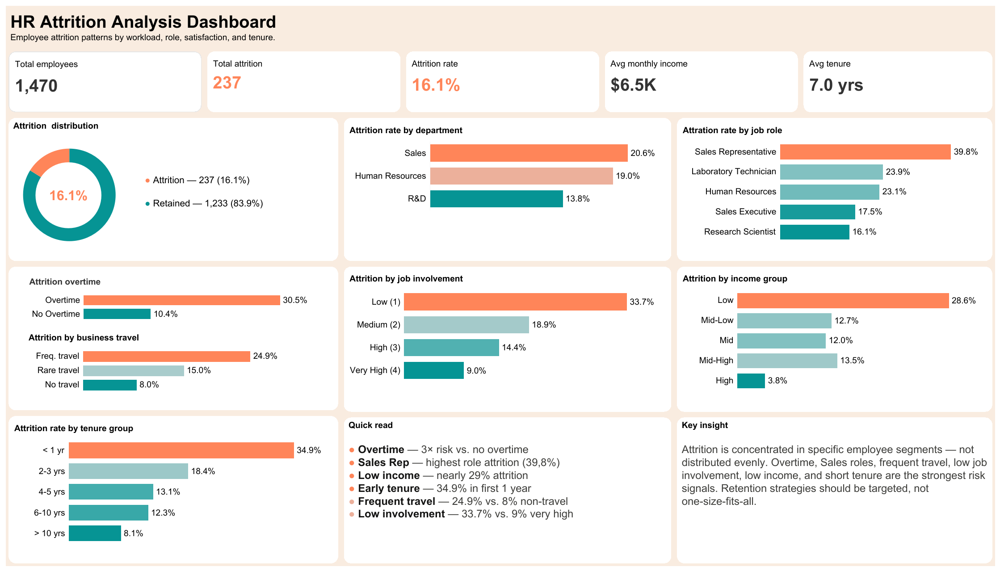

# HR Attrition Analysis

> **A data analyst portfolio project analyzing employee attrition patterns using Python (Jupyter Notebook) and Tableau. The dataset contains 1.470 employee records, covering department, job role, overtime, business travel, satisfaction, income, and tenure factors to identify key attrition risk segments.**

---

## Table of Contents

- [Overview](#overview)
- [Dataset](#dataset)
- [Business Questions](#business-questions)
- [Analysis Workflow](#analysis-workflow)
- [Dashboard Preview](#dashboard-preview)
- [Key Findings](#key-findings)
- [Insights](#insights)
- [Business Recommendations](#business-recommendations)
- [Project Structure](#project-structure)
- [How to Run](#how-to-run)
- [Tools](#tools)
- [About](#about)

---

## Overview
End-to-end exploratory data analysis of employee attrition data, focusing on identifying patterns and risk factors related to employees leaving the company.

This project analyzes attrition based on workload, job role, department, business travel, employee satisfaction, income group, and tenure. The final output is an interactive Tableau dashboard designed to support HR teams in monitoring attrition risk and prioritizing retention strategies.

This project demonstrates a full data analytics workflow:

data cleaning → exploratory data analysis → feature engineering → Tableau dashboard → business insight → recommendation

---

## Dataset

- **Source:** [IBM HR Analytics Employee Attrition & Performance Dataset](https://www.kaggle.com/datasets/pavansubhasht/ibm-hr-analytics-attrition-dataset) — Kaggle
- **Records:** 1.470 employees
- **Target values:** `Yes` = employee left, `No` = employee stayed
- **Key fields:** `Age`, `Department`, `JobRole`, `OverTime`, `BusinessTravel`, `MonthlyIncome`, `JobInvolvement`, `JobSatisfaction`, `WorkLifeBalance`, `StockOptionLevel`, `YearsAtCompany`


---

## Business Questions

1. **What is the overall employee attrition rate?**
2. **Which departments have the highest attrition rate?**
3. **Which job roles are most vulnerable to attrition?**
4. **How does overtime relate to employee attrition?**
5. **How does business travel frequency relate to attrition?**
6. **How do job involvement, satisfaction, and work-life balance relate to attrition?**
7. **How do income level and stock option benefits relate to attrition?**
8. **How does employee tenure relate to attrition risk?**
9. **Which employee segments should HR prioritize for retention strategies?**

---

## Analysis Workflow

### 1. Business Understanding
- Defined the business objective of analyzing employee attrition patterns.
- Formulated key business questions related to department, role, workload, satisfaction, income, and tenure.
- Set the analysis focus on identifying high-risk employee segments and providing actionable HR recommendations.

### 2. Data Collection
- Used an employee attrition dataset containing demographic, job-related, compensation, satisfaction, and tenure attributes.
- Loaded the dataset into Python for data preparation and exploratory analysis.

### 3. Data Understanding
- Explored the dataset structure, feature types, and target variable distribution.
- Checked missing values, duplicated records, and irrelevant columns.
- Identified key variables related to employee attrition.

### 4. Data Cleaning & Preparation
- Validated data completeness and consistency.
- Removed irrelevant columns such as employee identifiers and constant-value fields.
- Prepared the dataset for exploratory data analysis and Tableau visualization.

### 5. Feature Engineering
- Created `AttritionFlag` to calculate attrition rate in Tableau.
- Created employee segmentation fields such as `AgeGroup`, `IncomeGroup`, and `TenureGroup`.
- Added supporting fields such as overtime risk, promotion status, and career stage for dashboard analysis.

### 6. Exploratory Data Analysis
- Analyzed overall attrition distribution.
- Compared attrition rate by department, job role, overtime, business travel, gender, marital status, and education field.
- Examined satisfaction-related factors such as job involvement, job satisfaction, environment satisfaction, relationship satisfaction, and work-life balance.
- Evaluated compensation and tenure-related patterns, including monthly income, stock option level, total working years, and years at company.

### 7. Dashboard Development
- Exported the final cleaned dataset into CSV format for Tableau.
- Built an interactive Tableau dashboard to summarize attrition rate, high-risk roles, workload factors, satisfaction indicators, income group, and tenure group.

### 8. Insights & Recommendations
- Summarized key business findings from the dashboard.
- Developed HR recommendations related to workload management, retention programs, employee engagement, compensation review, and early-tenure support.

---
## Dashboard Preview

 
🔗 [View on Tableau Public](https://public.tableau.com/app/profile/fatwa.nurhidayat/viz/HRAttritionAnalysisDashboard_17804624898270/HRAttritionDashboard) 

---

## Key Findings

| # | Question | Finding |
|---|----------|---------|
| 1 | Overall Attrition | Out of 1,470 employees, 237 employees left the company, resulting in an overall attrition rate of **16.1%**. |
| 2 | Department | **Sales** had the highest department-level attrition rate at **20.6%**, followed by Human Resources at **19.0%** and R&D at **13.8%**. |
| 3 | Job Role | **Sales Representative** had the highest attrition rate at **39.8%**, followed by Laboratory Technician at **23.9%** and Human Resources at **23.1%**. |
| 4 | Overtime | Employees who worked overtime had an attrition rate of **30.5%**, compared to **10.4%** for employees without overtime. |
| 5 | Business Travel | Frequent business travelers had the highest attrition rate at **24.9%**, compared to **15.0%** for rare travelers and **8.0%** for non-travel employees. |
| 6 | Job Involvement | Employees with low job involvement had the highest attrition rate at **33.7%**, while employees with very high involvement had the lowest rate at **9.0%**. |
| 7 | Income Group | Low-income employees showed the highest attrition rate at **28.6%**, while high-income employees had the lowest rate at **3.8%**. |
| 8 | Tenure Group | Employees with less than 1 year at the company had the highest attrition rate at **34.9%**, while employees with more than 10 years had the lowest rate at **8.1%**. |

---

## Insights

### 1. Attrition is concentrated in specific employee segments

The overall attrition rate is 16.1%, but attrition risk is not evenly distributed across the workforce. Certain groups, such as overtime employees, Sales-related roles, frequent business travelers, low-income employees, and early-tenure employees, show much higher attrition rates.

This indicates that employee attrition is driven by specific workforce conditions rather than affecting all employees equally.

### 2. Overtime is one of the strongest attrition risk signals

Employees who worked overtime had nearly three times the attrition rate of employees without overtime. This suggests that workload pressure, long working hours, or poor work-life balance may contribute significantly to employee turnover.

Overtime should be monitored as an early warning indicator for attrition risk.

### 3. Sales-related roles require stronger retention attention

Sales had the highest attrition rate among departments, while Sales Representative had the highest attrition rate among job roles. This may indicate higher pressure, demanding targets, or lower role stability in sales-related positions.

HR should prioritize Sales-related roles when designing retention and engagement programs.

### 4. Low job involvement is strongly associated with attrition

Employees with low job involvement showed the highest attrition rate, while employees with very high involvement had the lowest attrition rate. This suggests that engagement, role clarity, recognition, and participation may influence employees' decision to stay.

Improving job involvement can be an important retention strategy.

### 5. Income and tenure are important retention factors

Low-income employees and employees with less than one year of tenure showed higher attrition rates. This suggests that compensation competitiveness and early employee experience are important factors in retention.

The company should pay special attention to early-career and early-tenure employees.

### 6. Frequent business travel may increase retention risk

Employees who traveled frequently had a higher attrition rate than employees who rarely traveled or did not travel. This may indicate that travel demands can create fatigue, work-life conflict, or dissatisfaction over time.

Business travel should be evaluated alongside workload and employee satisfaction.

---

## Business Recommendations

### 1. Monitor overtime as an early warning signal

HR should regularly monitor employees with frequent overtime because this group shows a much higher attrition rate. The company should evaluate workload distribution, staffing adequacy, and manager scheduling practices in teams with high overtime frequency.

### 2. Prioritize retention programs for high-risk roles

Sales Representative, Laboratory Technician, and Human Resources roles should receive more targeted retention attention due to their relatively high attrition rates. HR can conduct role-specific surveys, review workload expectations, and identify pain points for each high-risk role.

### 3. Improve workload planning and work-life balance

Employees with overtime and frequent business travel should be supported with better workload planning, flexible scheduling, recovery time, or additional benefits. This can help reduce fatigue and improve employee retention.

### 4. Strengthen employee engagement and job involvement

Since low job involvement is strongly associated with higher attrition, managers should improve role clarity, recognition, feedback frequency, and employee participation. Employees with low involvement scores should be identified early and supported through engagement initiatives.

### 5. Review compensation and benefits for vulnerable employee groups

Low-income employees showed higher attrition risk. The company should review compensation competitiveness, especially for lower-income and early-career employees, and consider retention-based incentives or long-term benefit programs.

### 6. Improve onboarding and early-tenure support

Employees with less than one year of tenure had the highest attrition rate. HR should strengthen onboarding, mentorship, career path communication, and regular check-ins during the first year of employment.

### 7. Use satisfaction and engagement metrics as retention indicators

Satisfaction, job involvement, and work-life balance metrics should be used as part of an HR monitoring system. These indicators can help identify employee segments that may need support before attrition occurs.

### 8. Build segmented retention strategies

Attrition risk differs by role, department, workload, business travel, income level, and tenure. HR should design targeted retention strategies instead of applying one-size-fits-all programs to all employees.

---

## Project Structure

```
hr-employee-attrition-analysis/
├── assets/
│   └── dashboard_preview.png
│   └── eda_employee-attrition.pdf
│
├── dashboard/
│   └── hr_attrition_analysis_dashboard.twb # Tableau workbook
│
├── notebook/
│   └── employee-attrition.ipynb # Data cleaning, EDA, and feature engineering
│
├── data/
│   └── hr-employee-attrition.csv # Raw dataset
│   └── hr_attrition_tableau_final.csv # Cleaned dataset used for Tableau
│
├── README.md
└── requirements.txt
```

---

## How to Run

1. Clone the repository
   ```bash
   git clone https://github.com/fatwanurhdyt/hr-employee-attrition-analysis.git
   cd hr-employee-attrition-analysis
   ```

2. Install dependencies
   ```bash
   pip install pandas matplotlib seaborn jupyter
   ```

3. Open the notebook
   ```bash
   jupyter notebook notebook/employee-attrition.ipynb 
   ```

4. For the dashboard, open `hr_attrition_tableau_final.csv` in Tableau or visit the Tableau Public link above.

---

## Tools

| Tool | Purpose |
|------|---------|
| Python (Pandas, Matplotlib, Seaborn) | Data cleaning & EDA |
| Jupyter Notebook | Analysis & documentation |
| Tableau Public | Interactive dashboard |
| GitHub | Version control & portfolio hosting |

---

## Author

**Fatwa Nurhidayat**
- GitHub: [@fatwanurhdyt](https://github.com/fatwanurhdyt)
- LinkedIn: [linkedin.com/in/fatwanurhdyt](https://linkedin.com/in/fatwanurhdyt)
- Email: [fatwa.nrhdyt@gmail.com](mailto:fatwa.nrhdyt@gmail.com)
